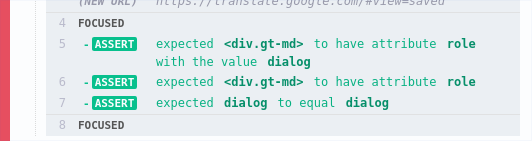

# Guide through Cypress
This repo represents a documented journey through the world of automated testing with Cypress. Knowledge is formally
 being attained from the Udemy course 
 [Cypress - Modern Automation Testing from Scratch + Framework](https://www.udemy.com/course/cypress-tutorial/). 
The rest of the content in this repo is info that is not easily attainable through the official Cypress documentation
.  Future contributions should be focused on experiential observations from working with Cypress.

## Tips
### How to preserve a session across multiple tests
Tip coming soon

### How to preserve a session across test suite runs
Tip coming soon

### How to write loops with Cypress
If the goal is to find all the elements on the page which can be focused on using only the TAB key to move focus
, then a conditional loop seems like it will be part of the solution.  All that would be needed is to loop until all
 the elements on the page have received focus or when no other element on the page can be TAB'd to.  This however
  will not be possible because loops are executed (synchronously) before all the Cypress commands.\
  Here is a first attempt at solving the problem:
```javascript
        cy.visit('https://translate.google.com')

        let foundHistoryBtn = false
        var itr = 0

        while(!foundHistoryBtn && ++itr < 28) {
            cy
                .focused()
                .invoke('text')
                .then((t) => {

                    if (t === 'History') {
                        cy.log('found history button')
                        foundHistoryBtn = true
                    }

                    cy.log('no history button found. t = ')
                    cy.log(t)
                })

            cy.tab()
        }
```
This novice solution has a big issue:
 asynchronous and synchronous code is being mixed. The while loop is determined to terminate before the Cypress
 commands are executed because when the code is first processed, the native commands such as the variable assignments
  and conditional loops are executed first. By the time the Cypress commands are executed, the while loop had already
   been executed; and it ended with the false evaluation of the conditional statement ```++itr < 28```.  Another
    issue in this code is the attempt to change the value of the variable ```foundHistoryBtn```.    
 
A solution that works without the use of conditional loops:
```javascript
Cypress.Commands.add('tabToHistorySidePanelLink', () => {
    function tabTo() {
        cy.tab()
        cy
            .focused()
            .invoke('text')
            .then((t) => {
                if (t === 'History') {
                    return
                }

                return tabTo();
            })
    }

    return tabTo();
})
```
This recursive method can be called during the execution of Cypress commands.  Termination of the function will be
 occur at the discovery of an element with text 'History'. 

### How to determine if the current element in focus is a child of a particular element
A working example: while executing many keyboard TAB events with Cypress,<sup>1</sup> you would like to determine if
 each current element in focus is a child of a particular element.<sup>2</sup> Determining if the current element is
  a child of a particular element should be an amortized O(1) procedure, and thus leaving the time complexity of the
   parent task, tabbing through all page elements, at O(*n*), where *n = amount of focusable elements*. 
   
To determine if an element is a child of another, there are several solutions:
1. ```cy.parents()```
 
 <sup>1</sup>The TAB event is the conventional method of navigating a page with a keyboard.\
 <sup>2</sup> The TAB event was used in this example to encourage forethought on the complexity of code surrounding our
  target problem.

## Unexpected pecularities 

Look at the code below. What is the value of ```user``` in the lambda function?
```javascript
    cy.visit('https://accounts.google.com')
    let username = cy.readFile('cypress/credentials.json').its('username')
    let password = cy.readFile('cypress/credentials.json').its('password')

    username.then((user) => {
        cy.get('#Email').type(user + '{Enter}')
    })

    password.then((pass) => {
        cy.get('#Passwd').type(pass + '{Enter}')
    })
```
The value assigned to ```user``` is the password and not the username.  The desired results can be achieved by
 calling ```then``` immediately after the first call to ```its```.

## Assertions
The test runner considers a single should statement without any chained functions as a single assertion. If single
 should is used to create a custom assertion, then only a single assert will be displayed in the Cypress Test Runner
  although there were really multiple assertions made. Observe the following lines of code and their output
   in the Test Runner (respectively shown in the image).
```javascript
        cy
            .focused()
            .should(($el) => {
                expect($el).to.have.attr('role', 'dialog')
            })
```
 vs.
 ```javascript
        cy
            .focused()
            .should('have.attr', 'role').and('eq', 'dialog')
```



#### If keyboard focus is on an element with a child, then is the proposition that the element's child has keyboard focus true? 


## Cookies
Stories about the complicated nature of cookie management are coming soon.

## Miscellaneous
* If there are multiple assertions in a single test and the first assertion fails, then the subsequent assertions will
 not be processed. 

* If tests are expected to finish executing as quickly as possible, then the order in which the tests are executed can
 matter. Most states of the website are preserved by the browser between tests. If test *t+1* requires the website to be in a specific state before it is executed, then it would be more
  efficient if the test *t+1* followed a test *t* that would leave the website in a usable state.  

* ```cy.get('div.page:nth-child(2')``` is valid although there is a parenthesis missing after '2'. Need to check if
 this has been reported as a bug.
 
* Unable to execute an ```onclick``` event with the function ```type('{Enter}')```. The side panel link elements have
 an anchor element with an onclick attribute with an event and an href with value ```javascript:void(0);```

